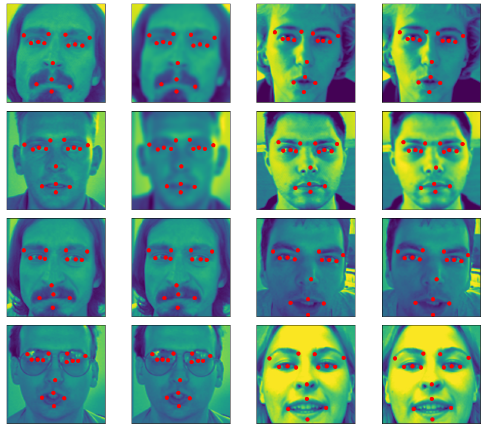
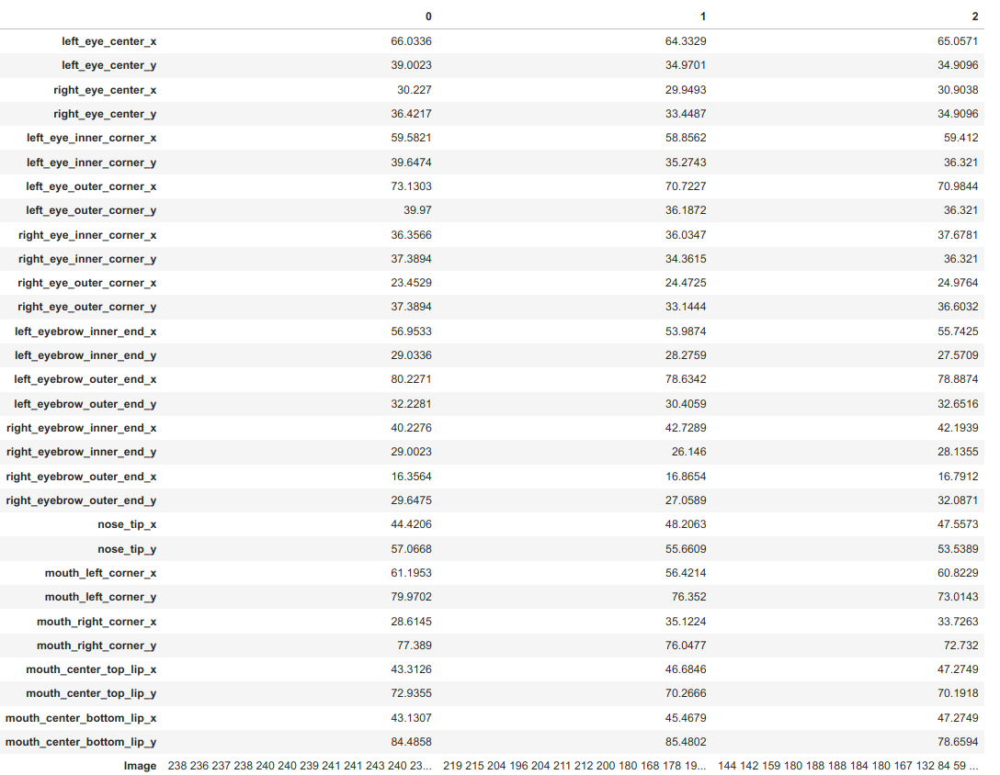

# Report7 - 检测人脸的关键点

人脸关键点检测可以应用到很多领域，例如捕捉人脸的关键点，然后驱动动画人物做相同的面部表情；识别人脸的面部表情，让机器能够察言观色等等。

## 数据

在本项目中训练数据包含15个面部的特征点和面部的图像，15个特征点分别是：

left_eye_center, right_eye_center, left_eye_inner_corner, left_eye_outer_corner, right_eye_inner_corner, right_eye_outer_corner, left_eyebrow_inner_end, left_eyebrow_outer_end, right_eyebrow_inner_end, right_eyebrow_outer_end, nose_tip, mouth_left_corner, mouth_right_corner, mouth_center_top_lip, mouth_center_bottom_lip

每个面部的特征点由两个实数(x,y)表达，是像素坐标。在某些数据中，一些面部的关键点数据缺失了，在`csv`数据中表现为两个逗号之间没有数据。

面部的图像是数据文件中，最后一列，有一系列的像素构成的数组（行优先的顺序，也就是像素从左向右扫描，然后是第二行像素。。。）每个像素的值由一个8位整数表示，值域是[0,255]，图像的尺寸是 96x96。

一些示例的图像和可视化的特征点如下图所示

三个示例样本的数据如下图所示：

数据集包含两个文件 `train.csv` （从`train.zip`解压得到）和 `test.csv` （从`test.zip`解压得到）。
* `training.csv`: 包含7049个样本，每行数据包括15个面部关键点的(x,y)像素坐标，以及一张以行优先的96x96的图像
* `test.csv`: 包含1783个数据，格式和训练数据一样

## 要求

1. 分析数据文件的特点，读取数据文件中面部关键点的坐标，读取面部图像
2. 根据面部关键点的特性，设计网络架构
3. 编程实现面部关键点预测的网络，使用训练数据对网络进行训练
4. 使用测试数据分网络的性能
5. 分析自己实现的方法的问题，以及如何改进。
6. 深入思考，如何更进一步提高网络的性能？
7. 按照`report_template.ipynb`撰写自己的报告。

